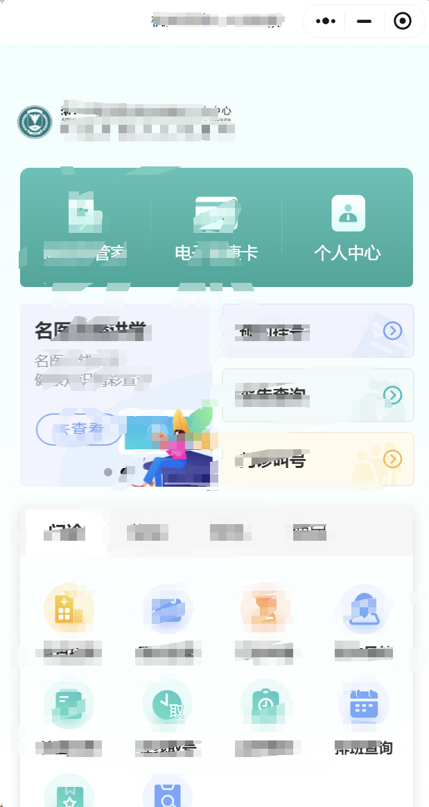
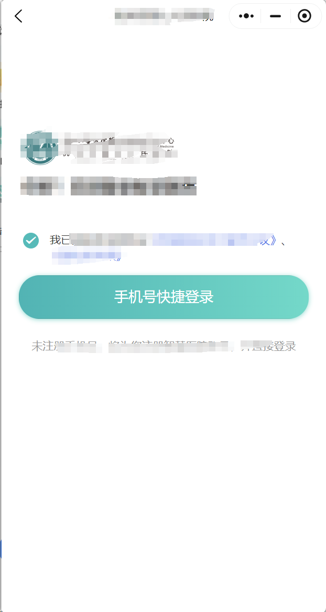
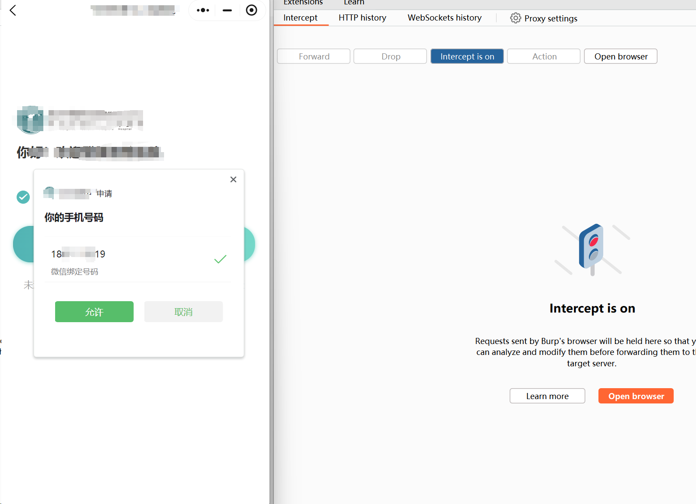
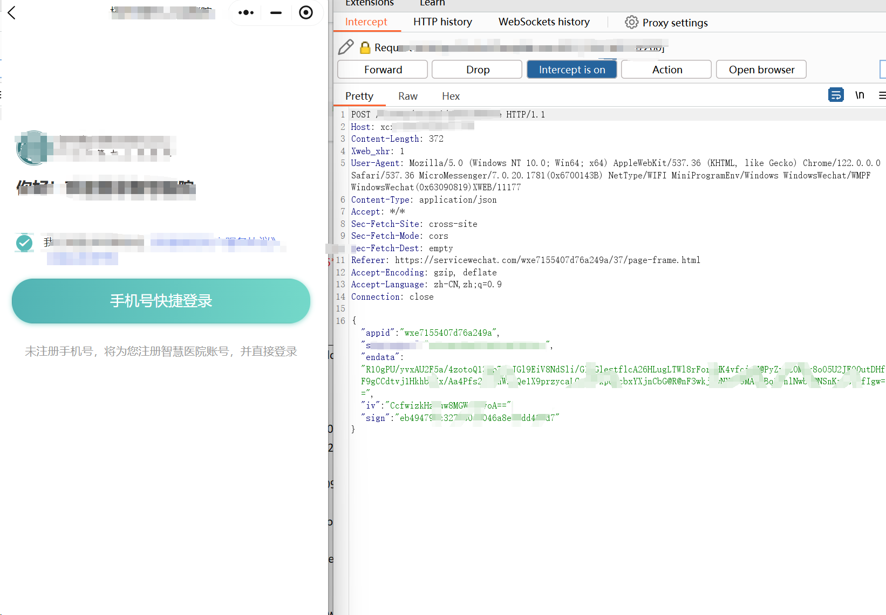
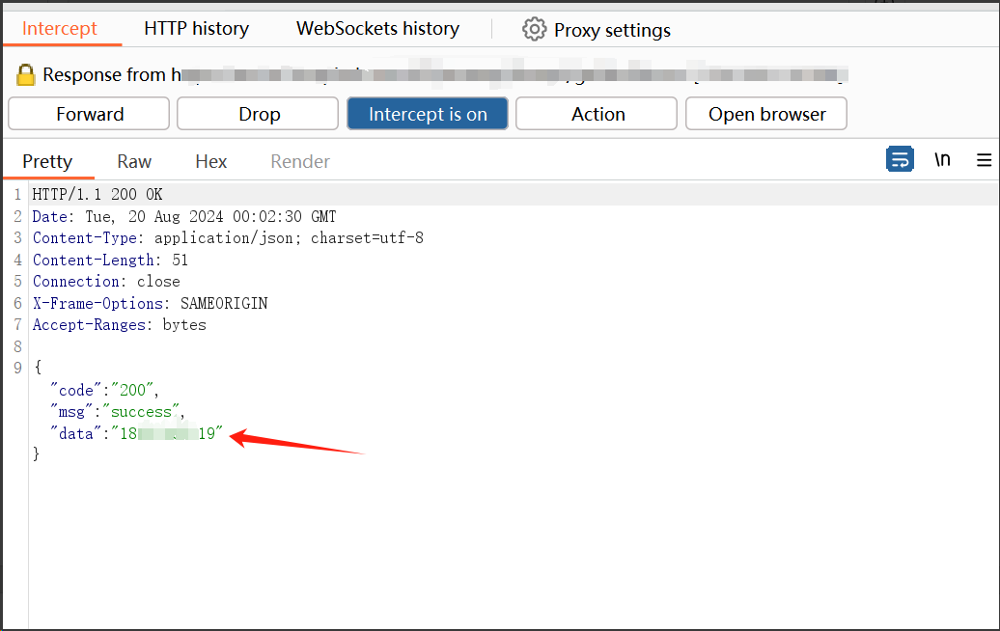
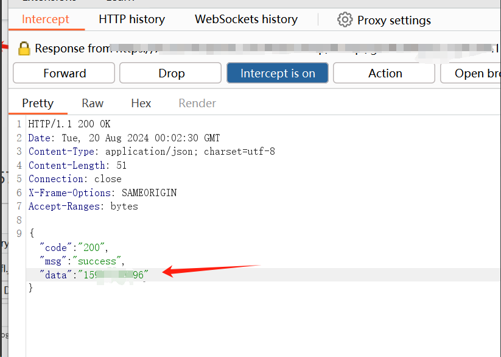
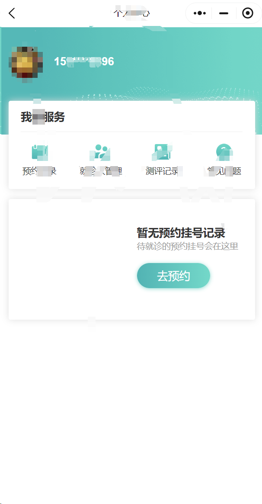
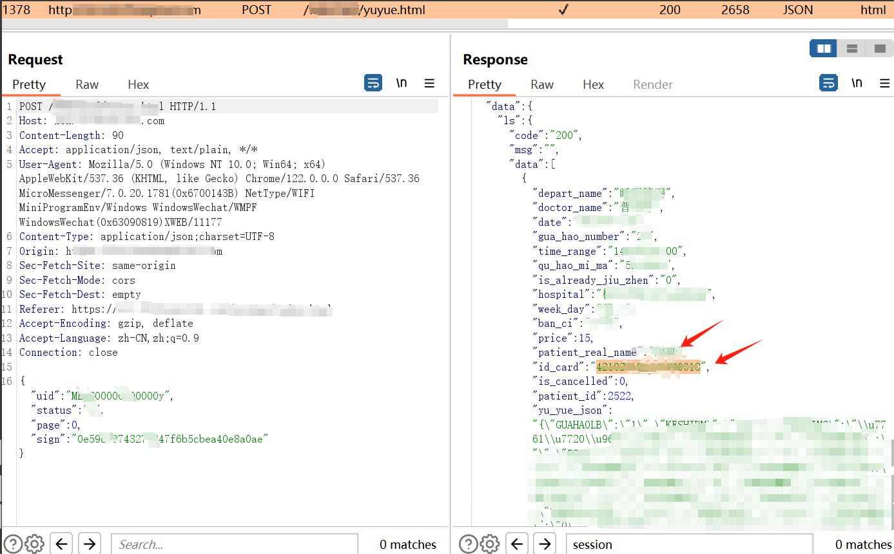
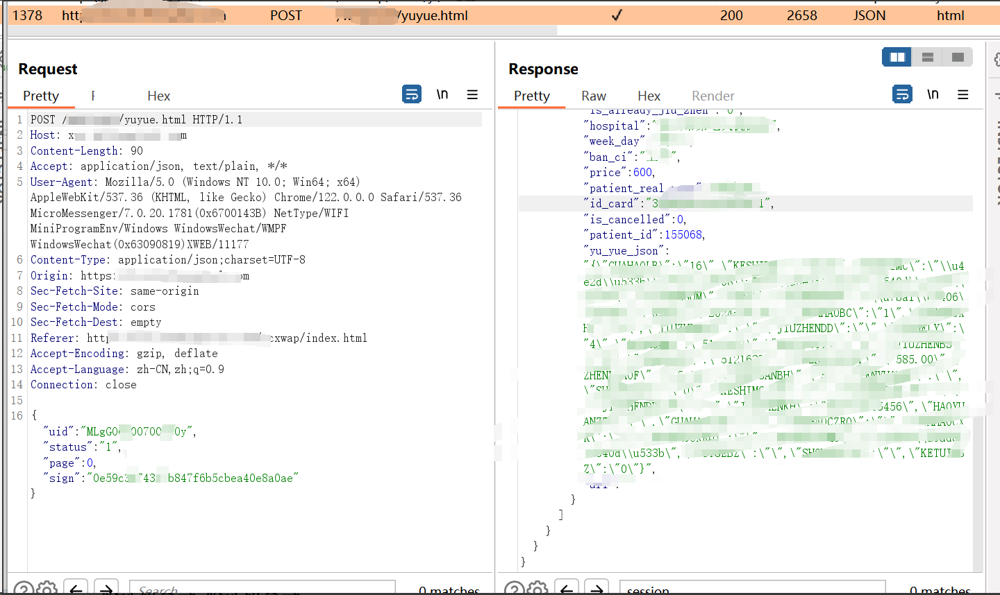

# Proof of Concept (PoC) for MiniPVRF in "xxxxxx" WeChat Mini Program of wxe7155XXXX76a249a

### Arbitrary Account Takeover 

## 1. Prerequisites for Reproduction

- Burp Suite tool (configured to capture network packets of WeChat Mini Programs)
- WeChat application (to search and open the "wxe7155XXXX76a249a" Mini Program)

## 3. Vulnerability Reproduction Steps

### Step 1: Locate and Open the Target Mini Program

1. Open the WeChat application.

2. Search for the Mini Program appid **"wxe7155XXXX76a249a" **.

3. Open the searched Mini Program.

   

### Step 2: Navigate to the Login Page

1. After opening the Mini Program, click on the **"Personal Center" (个人中心)** section.
2. 
3. On the "Personal Center" page, select the **"Quick Login via Mobile Phone Number" (手机号快捷登录)** option.

### Step 3: Capture the Login Request Packet with Burp Suite

1. Enable the **Intercept Mode** in Burp Suite.

2. On the Mini Program's login page, click the **"Allow" (允许)** button when prompted for mobile phone number authorization.

   

3. Burp Suite will intercept the following HTTP request packet. Note that the mobile phone number in the authorization prompt is **18*\**\**19** (the attacker's phone number).

   


The intercepted POST request packet is as follows:

```http
POST /xcxxxxxxxxxxxx HTTP/1.1
Host: xcx.xxxxxxxxxx.com
Content-Length: 372
Xweb_xhr: 1
User-Agent: Mozilla/5.0 (Windows NT 10.0; Win64; x64) AppleWebKit/537.36 (KHTML, like Gecko) Chrome/122.0.0.0 Safari/537.36 MicroMessenger/7.0.20.1781(0x6700143B) NetType/WIFI MiniProgramEnv/Windows WindowsWechat/WMPF WindowsWechat(0x63090819)XWEB/11177
Content-Type: application/json
Accept: */*
Sec-Fetch-Site: cross-site
Sec-Fetch-Mode: cors
Sec-Fetch-Dest: empty
Referer: https://servicewechat.com/wxe7155XXXX76a249a/37/page-frame.html
Accept-Encoding: gzip, deflate
Accept-Language: zh-CN,zh;q=0.9
Connection: close

{"appid":"wxe7155XXXX76a249a","endata":"3wkj/wNY8f9MAwSBqZ8hlNwb5@NSnKrhsGffIgw==","iv":"CGWcq9yoA==","sign":"eb494798c3274b0fd046a8ed9dd49bd7"}
```

### Step 4: Tamper with the Response Packet to Modify the Mobile Phone Number

1. Keep Burp Suite in Intercept Mode and wait to intercept the **response packet** corresponding to the above POST request.
   
2. In the intercepted response packet, modify the mobile phone number field from the original number (18****19) to the **victim's mobile phone number (e.g., 15****************************96).
   **

### Step 5: Complete the Arbitrary Account Login

1. Click the **"Forward"** button in Burp Suite to send the tampered response packet to the Mini Program.
2. Disable Intercept Mode in Burp Suite.
3. The Mini Program will receive the tampered response and automatically log in to the account associated with the modified mobile phone number (15\*\*\*\*\*\*\*\*\*\*\*96).
   **

## 4. Proof of Information Leakage

After successfully logging into the victim's account (15\*\*\*\*\*\*\*\*\*\*\*96)):

1. On the account homepage, click the **"Appointment Records" (预约记录)** option.
   **
2. In the "Appointment Records" page, the victim's **ID card number** and other sensitive personal information are directly displayed, confirming the leakage of core user data.
   **